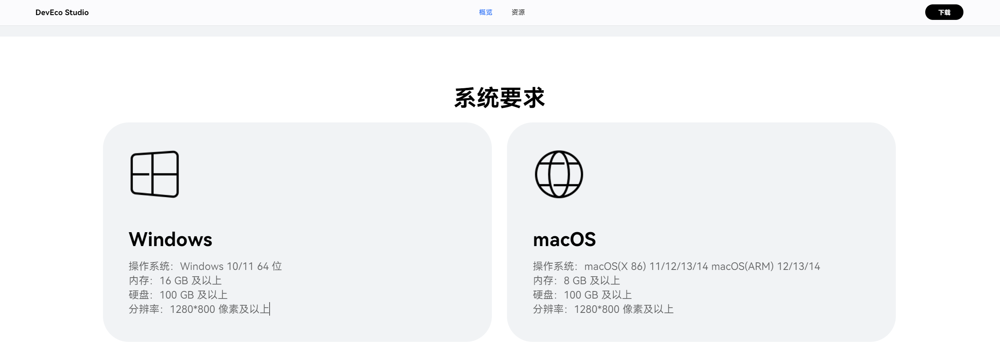

### 1. 项目介绍

首先这个只是我们选修课的实验代码，并没有什么实际意义

### 2. 项目结构

除了lab-report-doc文件夹里面是实验报告，另外几份都是实验代码

代码，实验编号和指导书对应关系如下：

| 实验编号 | 指导书内容 | 代码文件夹 |
|---------|---------|---------|
| 实验一  | 1.2  | lab_helloworld |
| 实验二  | 1.3  | SimpleCalculator  |
| 实验三  | 1.5  | preferences  |
| 实验四  | 1.6  | app-account-manager  |
| 实验五  | 1.7  | UserAuth  |
| 实验六  | 1.4  | NativeTemplate  |


### 3. 环境配置

自己下载 DevEco Studio, 导入项目即可。  

### 4. 碎碎念

1.大家注意一下开发环境的要求：



我有一个朋友的硬件差了点导致跑不起来


大家不要瞎猜


2.如果你的系统没有适配DevEco Studio……希望你不是下面这种：


3.大家都看过实验指导的PDF，那我也不说啥了：

虽然指导材料里给了样例代码（而且确实可以拿来用），但是实验三和实验六的代码因为版本更新的问题，已经不能找到源代码了

如果你想找实验三的旧版本代码，那么……有的，兄弟，有的：

仓库：[preferences](https://gitee.com/harmonyos_samples/preferences)

克隆仓库：

```cmd
git clone https://gitee.com/harmonyos_samples/preferences.git
```

实验六就没有了，自己找吧

[这个是新版本NativeTemplate的官方代码](https://gitee.com/harmonyos_codelabs/NativeTemplate)

4.大家注意一下别学某公司在别人家的issue里问能不能让开发者主动适配。